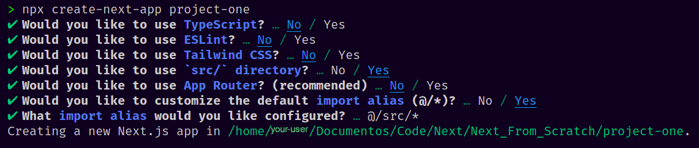
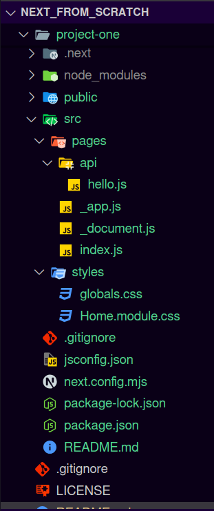
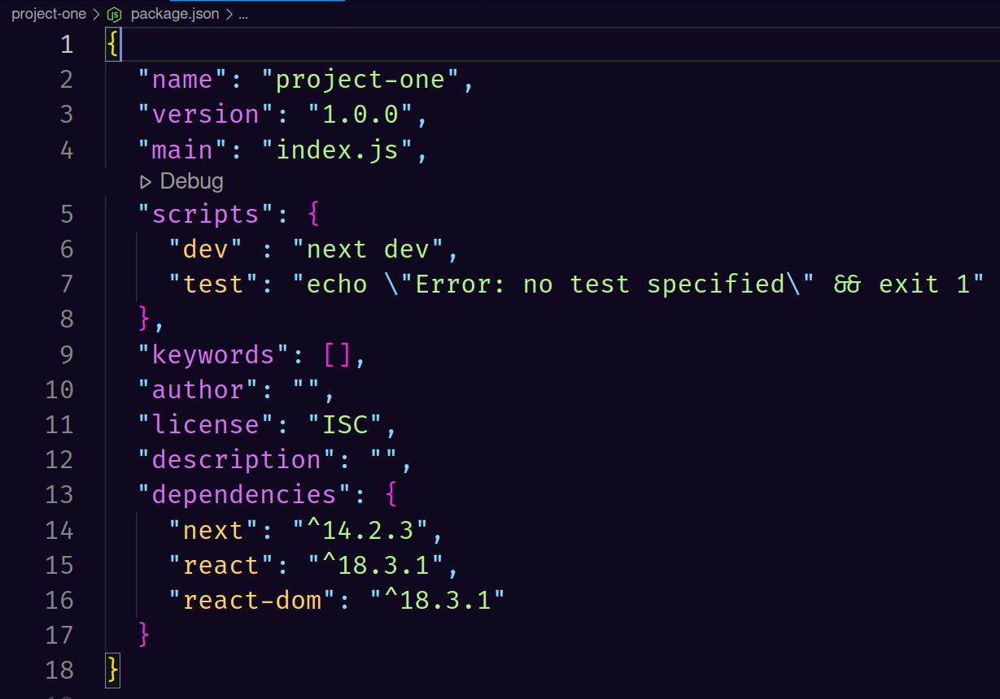
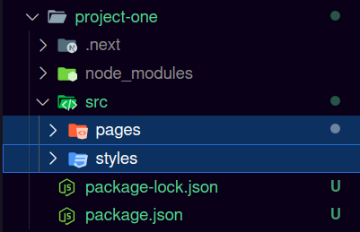

# Next From Scratch
### Learning NextJS from scratch

### If you want to learn NextJS this is tutorial is for you.

### Berfore you start be aware that you are writing your own code, you can copy and paste, but I don't garantee you are learning anything!

##
# NextJS

### NextJS is a [React](https://react.dev/) framework, used in webdevelopment, created by [Vercel.](https://vercel.com/frameworks/nextjs)

### As NextJS is a React framework, the essential basics of React will be shown here. 

#### This tutorial is not focused on React.
##
# Requirements

### For this tutorial, as suggestion, it's recomended using [VSCode](https://code.visualstudio.com/download) from Microsoft.

### Be sure Node is installed in your computer, for this, run:

    $ node -v
    v21.7.3

### If it returns the verison, is installed, 

### If not, run this command for installing:

##
# Instalation
#### Windows:

### you can access [Node.js](https://nodejs.org/en/download) and install the LTS version

##
#### [Debian](https://nodejs.org/en/download/package-manager) :

    $ sudo apt update

    $ sudo apt upgrade -y

    $ curl -o- https://raw.githubusercontent.com/nvm-sh/nvm/v0.39.7/install.sh | bash

    $ nvm install 20

##
#### [Arch Linux](https://wiki.archlinux.org/title/Node.js) :

    $ sudo pacman -Syu node

##
### After installing Node, be sure you are running Node version >= 10.3.

### For start a new NextJS project, run:

    $ npx create-next-app <project-name>

### There are some configurations you can preeviously set, by this tutorial, use the following configuration:

##
### If everything went well, your projects should looks like this:

##
### If you would like to create a project from beginning, create a folder with your `project-name`.

### If you are in linux, run:

    $ mkdir <project-name>

### Open the project folder on your editor and open the terminal:

### On VSCode we can use the shortcut

    ctrl + shift + '

### Now that your terminal is opened, go to your project folder with:

    $ cd <project-name>

### After changing into your project folder, run this command for default configuration:

    $ npm init -y

### Now, run the following command for installing the dependences:

    $ npm i next react react-dom

### After thar command, the file `package.json` should be in ur `<project-name>` folder, it's essential for you to create a new line on your file,

### Be sure this lines are in your document `package.json`:

### Inside your project file, create a new folder called `src`

### Inside `src` create a folder called: `pages` 

### Still inside `src` create another folder called: `styles`

### The folder `pages` is where all `.js` are gonna be.

### The folder `styles` is where all `.css` folders are gonna be.

### Inside th folder `pages` insert a new file called `index.js`

### For a simple example, inside `index.js`, write the follow code in your editor:

    import React from 'react';

    const Home = () => {
        return(
             
Home

        );
    };
      
    export default Home;

## Running your app in your localhost server

### Be sure you are in your `project file` folder.

### You can run your application with the command:

    $ npm run dev

### Now you are running a localhost server in port 3000 by default

### You can `ctrl` + `click` in URL in your terminal or,

### Go to your favorite Browser then access:

    http://localhost:3000

#### You can check others tutorials, in the `README.me` file in other folders in this project..

